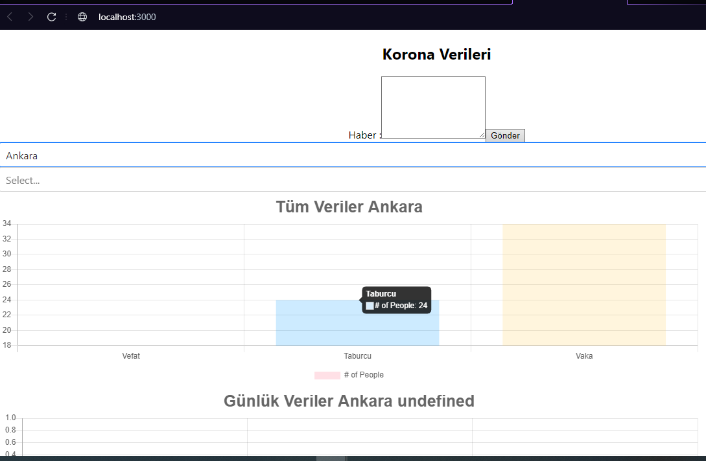
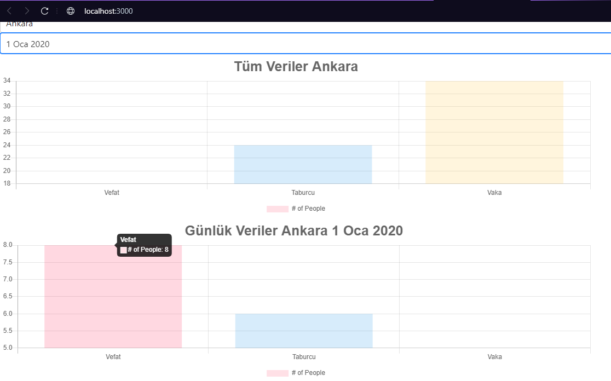

# Corona Tracker
## Table of contents
* [General info](#general-info)
* [Technologies](#technologies)
* [Setup](#setup)
* [Illustrations](#illustrations)
* [How To Use](#how-to-use)

## General info
Simple corona virus information tracker.

## Technologies
Project is created with:
* Java SDK 11 version 11.0.9
* Maven 3.6.3
* axios 0.21.1
* react 17.0.1
* react-chartjs-2 2.11.1

## Setup
To run this project, download the project and go to the directory it is located.
```
$ cd src\main\react-frontend
$ npm install
$ npm start
```

## How To Use
Sample news entry like:
  Örnek Haber 1: 20.04.2020 tarihinde Ankara da Korona virüs salgınında yapılan testlerde 15 yeni vaka bulundu. 1 kişi korona dan vefat etti. 5 kişide taburcu oldu.
  Örnek Haber 2: Korona virüs salgınında yapılan testlerde 19.04.2020 tarihinde  İstanbul da 30 yeni vaka tespit edil. İstanbul da taburcu sayısı 7 kişi .  3 kişi de vefat etti.
  Örnek Haber 3: 19.04.2020 tarihinde İstanbul  için korona virüs ile ilgili yeni bir açıklama yapıldı. Korona virüs salgınında yapılan testlerde 20 yeni vaka tespit edildi. taburcu sayısı ise 7 oldu.  3 kişin de vefat ettiği öğrenildi.
  Örnek Haber 4: Ankara da korona virüs tablosu. Vaka sayısı 4. Vefat eden sayısı 3. Taburcu edilenlerin sayısı ise 12.

## Illustrations
#### When you choose a city from dropdown it shows you the all information of the city.



#### When you choose a date from dropdown it shows you the daily information of the city.




